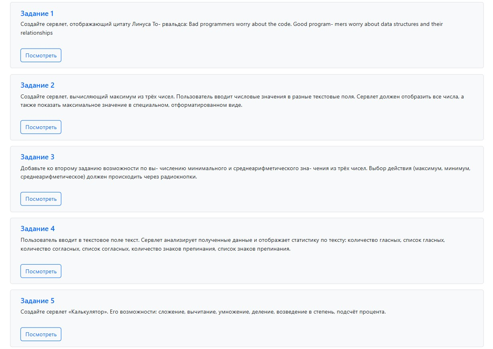
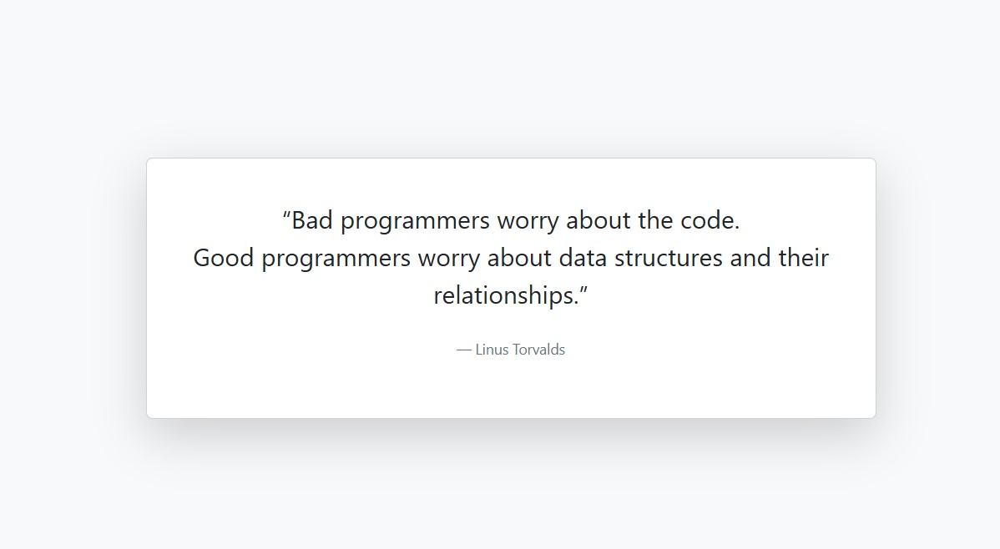

# «Программирование с использованием технологии Java и СУБД Oracle»

## Тема: Введение в разработку серверных решений с использованием Java. Часть 1

### Задание 1

Создайте сервлет, отображающий цитату Линуса To-
рвальдса:

Bad programmers worry about the code. Good program-
mers worry about data structures and their relationships

### Задание 2

Создайте сервлет, вычисляющий максимум из трёх
чисел. Пользователь вводит числовые значения в разные
текстовые поля. Сервлет должен отобразить все числа,
а также показать максимальное значение в специальном,
отформатированном виде.

---

### Задание 3

Добавьте ко второму заданию возможности по вычислению минимального и среднеарифметического значения из трёх чисел. Выбор действия (максимум, минимум, среднеарифметическое) должен происходить через
радиокнопки.

---

### Задание 4

Пользователь вводит в текстовое поле текст. Сервлет
анализирует полученные данные и отображает статистику
по тексту: количество гласных, список гласных, количество
согласных, список согласных, количество знаков препинания, список знаков препинания.

---

### Задание 5

Создайте сервлет «Калькулятор». Его возможности:
сложение, вычитание, умножение, деление, возведение
в степень, подсчёт процента.

---

http://localhost:8080/JAVA_HW_10_1-1.0-SNAPSHOT/

